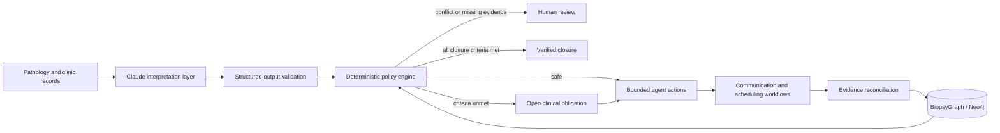

# Closed Care Loop

**The clinical obligation agent that carries care from documented to done.**

Closed Care Loop detects unresolved obligations created by clinical care, gathers evidence across fragmented workflow systems, proposes bounded actions, blocks unsafe automation, and verifies that the intended care actually occurred.

The hackathon MVP focuses on one high-risk dermatology workflow:

> Pathology result → patient notification → correct treatment scheduling → completed treatment → verified closure

The product is an evolution of DermPathOS / BiopsyGraph. The graph remains the evidence and relationship layer; Closed Care Loop is the agentic workflow and product layer.

## Problem

A biopsy result can be reviewed without the patient being contacted. The patient can be notified without treatment being scheduled. Treatment can be scheduled, then canceled, while a task remains marked handled. Conflicting laterality can also move into a surgical workflow unless someone catches it manually.

Most systems track activity. Closed Care Loop tracks the clinical obligation until the outcome is proven.

## Agent loop

1. **Detect** missing, conflicting, or stale evidence.
2. **Decide** what bounded workflow is permitted by clinic policy.
3. **Act** by drafting outreach, creating tasks, routing work, or stopping automation.
4. **Verify** communication, scheduling, treatment, and final closure.
5. **Escalate** whenever the record is incomplete or contradictory.

## Three-case demo

### 1. Lost melanoma

A melanoma in situ result has been available for four days. The agent finds no documented patient contact, referral, or treatment plan and proposes urgent clinician-reviewed outreach.

### 2. Wrong-site conflict

The pathology report says **left cheek**, while the scheduling request says **right cheek**. The agent blocks the workflow and requires clinician verification instead of guessing.

### 3. False closure

A patient was notified and scheduled for Mohs surgery, but the appointment was canceled and never replaced. The agent reopens the obligation because scheduled is not the same as treated.

A fourth benign case demonstrates that low-risk results still require documented communication before closure.

## Safety model

Closed Care Loop separates model interpretation from clinical policy enforcement.

### Claude interpretation layer

Claude can:

- interpret messy pathology and workflow context
- identify potential operational risks
- return structured output
- quote evidence from the supplied record
- surface unresolved questions

Claude cannot:

- diagnose or independently alter treatment
- override deterministic closure rules
- resolve contradictory body sites
- send patient-facing communication without approval
- close a clinical obligation without required evidence

### Deterministic policy layer

Typed application logic controls:

- urgency and deadline rules
- allowed actions
- site-conflict blocking
- workflow state transitions
- closure requirements
- audit events
- fallback behavior

Model output is schema-validated. If the model call fails, returns invalid JSON, or is not configured, the application uses deterministic fallback logic and labels that mode visibly.

## Architecture



## Current stack

- TanStack Start, React 19, TypeScript
- Tailwind CSS
- Claude Messages API through a server route
- Zod validation for model output
- Neo4j graph integration
- Butterbase persistence integration
- RocketRide integration adapter
- Local synthetic-data fallback for reliable demos

## Routes

- `/` product thesis and demo entry
- `/dashboard` clinical obligation command center
- `/cases/:caseId` evidence, workflow, actions, audit trail, and graph reasoning
- `/agent-review` visible Claude interpretation and fallback demonstration
- `/intake` pathology result intake
- `/architecture` integration architecture

## Run locally

```bash
npm install
npm run dev
```

Then open the local URL printed by Vite.

## Environment variables

The deterministic demo works without external credentials.

To enable live Claude interpretation:

```bash
ANTHROPIC_API_KEY=...
ANTHROPIC_MODEL=...
```

The model identifier is intentionally configured through the environment rather than hardcoded so the deployment can use the event-approved Anthropic model.

Existing optional integrations use:

```bash
BUTTERBASE_API_URL=...
BUTTERBASE_APP_ID=...
BUTTERBASE_API_KEY=...
NEO4J_URI=...
NEO4J_USERNAME=...
NEO4J_PASSWORD=...
ROCKETRIDE_URL=...
ROCKETRIDE_API_KEY=...
```

Only describe an integration as live during judging when its credentials are configured and its end-to-end path has been tested.

## Production pathway

1. Ingest obligations from ambient notes, pathology feeds, fax, and EHR events.
2. Map each obligation to clinic-authored policy and closure criteria.
3. Connect approved actions to EHR tasks, communications, scheduling, and referral systems.
4. Reconcile new evidence continuously.
5. Maintain an auditable obligation graph across specialties.

Expansion workflows include abnormal labs, imaging follow-up, referrals, medication monitoring, prior authorization, and post-discharge care.

## Demo script

1. Click **Run the 3-case demo**.
2. Open Sarah Miller to show the lost melanoma and approve urgent outreach.
3. Open Robert Lee to show the laterality conflict and safety interlock.
4. Open James Carter to show the canceled appointment and reopen the obligation.
5. Open **Claude Review** to show structured interpretation, source quotations, validation, and deterministic fallback.
6. Close with: **A reviewed result is not closed care. Closed Care Loop keeps working until the patient receives the intended care.**

## Data and clinical disclaimer

All included patients and records are synthetic. This repository is a hackathon prototype, not a deployed medical device or a substitute for clinician judgment. Production use would require security, privacy, clinical governance, integration validation, monitoring, and organization-specific policy configuration.
